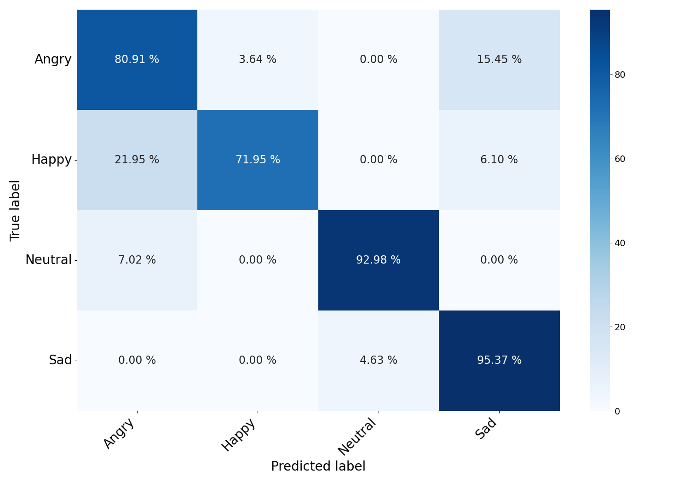
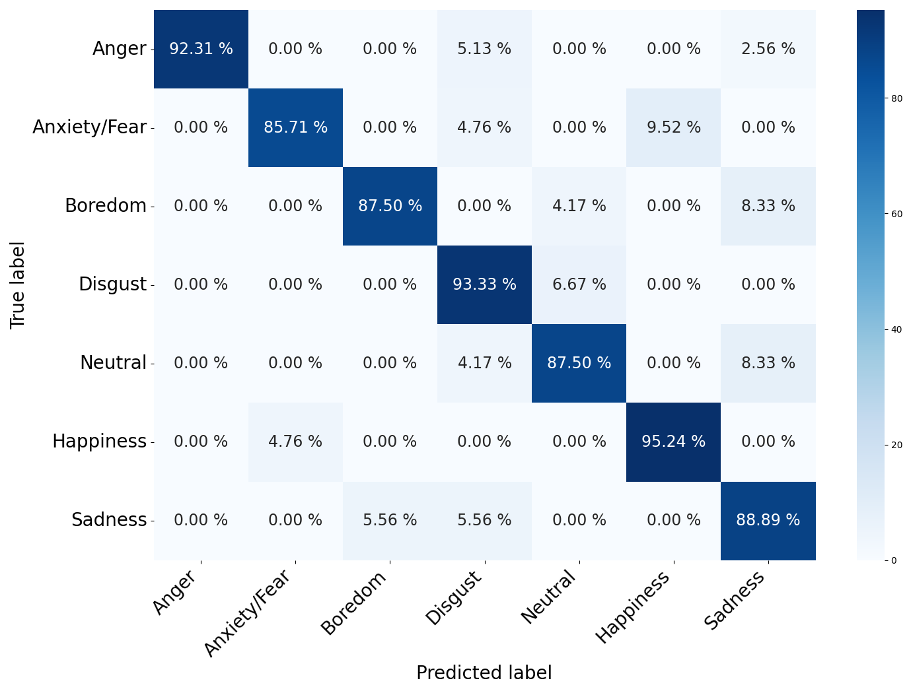

<a name="readme-top"></a>

<!-- PROJECT LOGO -->
<br />

<div align="center">
  <a href="https://github.com/alaaNfissi/SigWavNet-Learning-Multiresolution-Signal-Wavelet-Network-for-Speech-Emotion-Recognition">
    
  </a>

  <h3 align="center">SigWavNet: Learning Multiresolution Signal Wavelet Network for Speech Emotion Recognition</h3>

  <p align="center">
    This paper has been submitted for publication in IEEE Transactions on Affective Computing.
    <br />
   </p>
   <!-- <a href="https://github.com/alaaNfissi/SigWavNet-Learning-Multiresolution-Signal-Wavelet-Network-for-Speech-Emotion-Recognition"><strong>Explore the docs »</strong></a> -->
</div>
   

  
<div align="center">

[](https://github.com/alaaNfissi/SigWavNet-Learning-Multiresolution-Signal-Wavelet-Network-for-Speech-Emotion-Recognition/#readme "Go to project documentation")

</div>  


<div align="center">
    <p align="center">
    ·
    <a href="https://github.com/alaaNfissi/SigWavNet-Learning-Multiresolution-Signal-Wavelet-Network-for-Speech-Emotion-Recognition/issues">Report Bug</a>
    ·
    <a href="https://github.com/alaaNfissi/SigWavNet-Learning-Multiresolution-Signal-Wavelet-Network-for-Speech-Emotion-Recognition/issues">Request Feature</a>
  </p>
</div>


<!-- TABLE OF CONTENTS -->
<details>
  <summary>Table of Contents</summary>
  <ol>
    <li><a href="#abstract">Abstract</a></li>
    <li><a href="#built-with">Built With</a></li>
    <li>
      <a href="#getting-started">Getting Started</a>
      <ul>
        <li><a href="#getting-the-code">Getting the code</a></li>
        <li><a href="#dependencies">Dependencies</a></li>
        <li><a href="#reproducing-the-results">Reproducing the results</a></li>
      </ul>
    </li>
    <li>
      <a href="#results">Results</a>
      <ul>
        <li><a href="#on-iemocap-dataset">On IEMOCAP dataset</a></li>
        <li><a href="#on-tess-dataset">On EMO-DB dataset</a></li>
      </ul>
    </li>
    <li><a href="#contributing">Contributing</a></li>
    <li><a href="#license">License</a></li>
    <li><a href="#contact">Contact</a></li>
  </ol>
</details>


<!-- ABSTRACT -->
## Abstract

<p align="justify"> In the field of human-computer interaction and psychological assessment, speech emotion recognition (SER) plays an important role in deciphering emotional states from speech signals. Despite advancements, challenges persist due to system complexity, feature distinctiveness issues, and noise interference. This paper introduces a new end-to-end (E2E) deep learning multi-resolution framework for SER, addressing these limitations by extracting meaningful representations directly from raw waveform speech signals. By leveraging the properties of the fast discrete wavelet transform (FDWT), including the cascade algorithm, conjugate quadrature filter, and coefficient denoising, our approach introduces a learnable model for both wavelet bases and denoising through deep learning techniques. The framework incorporates an activation function for learnable asymmetric hard thresholding of wavelet coefficients. Our approach exploits the capabilities of wavelets for effective localization in both time and frequency domains. We then combine one-dimensional dilated convolutional neural networks (1D dilated CNN) with a spatial attention layer and bidirectional gated recurrent units (Bi-GRU) with a temporal attention layer to efficiently capture the nuanced spatial and temporal characteristics of emotional features. By handling variable-length speech without segmentation and eliminating the need for pre or post-processing, the proposed model outperformed state-of-the-art methods on IEMOCAP and EMO-DB datasets.</p>
<div align="center">
  
![model-architecture][model-architecture]
  
*L-LFDWTB SigWavNet General Architecture*
  
</div>

<p align="right">(<a href="#readme-top">back to top</a>)</p>


### Built With
* 
* 
* 
* 
* 
* 

<p align="right">(<a href="#readme-top">back to top</a>)</p>


<!-- GETTING STARTED -->
## Getting Started
<p align="justify">
To ensure consistency and compatibility across our datasets, we first convert all audio signals to a uniform 16 KHz sampling rate and mono-channel format. We then divide each dataset into two primary subsets: 90% for training and validation purposes, and the remaining 10% designated for testing as unseen data. For the training and validation segments, we implement a 10-fold cross-validation method. This partitioning and the allocation within the cross-validation folds leverage stratified random sampling, a method that organizes the dataset into homogenous strata based on emotional categories. Unlike basic random sampling, this approach guarantees a proportional representation of each class, leading to a more equitable and representative dataset division.</p>

<p align="justify">
In the quest to identify optimal hyperparameters for our model, we utilize a grid search strategy. Hyperparameter tuning can be approached in several ways, including the use of scheduling algorithms. These schedulers can efficiently manage trials by early termination of less promising ones, as well as pausing, duplicating, or modifying the hyperparameters of ongoing trials. For its effectiveness and performance, we have selected the Asynchronous Successive Halving Algorithm (ASHA) as our optimization technique.
The data preprocessing used in this study is provided in the `Data_exploration` folder.  
</p>

### Getting the code

You can download a copy of all the files in this repository by cloning the
[git](https://git-scm.com/) repository:

    git clone https://github.com/alaaNfissi/SigWavNet-Learning-Multiresolution-Signal-Wavelet-Network-for-Speech-Emotion-Recognition.git

or [download a zip archive](https://github.com/alaaNfissi/SigWavNet-Learning-Multiresolution-Signal-Wavelet-Network-for-Speech-Emotion-Recognition/archive/refs/heads/main.zip).

### Dependencies

<p align="justify">
You'll need a working Python environment to run the code.
The recommended way to set up your environment is through the
[Anaconda Python distribution](https://www.anaconda.com/download/) which
provides the `conda` package manager.
Anaconda can be installed in your user directory and does not interfere with
the system Python installation.
The required dependencies are specified in the file `requirements.txt`.
We use `conda` virtual environments to manage the project dependencies in
isolation.
Thus, you can install our dependencies without causing conflicts with your
setup (even with different Python versions).
Run the following command to create an `ser-env` environment to create a separate environment:
  
```sh 
    conda create --name ser-env
```

Activate the environment, this will enable it for your current terminal session. Any subsequent commands will use software that is installed in the environment:

```sh 
    conda activate ser-env
 ```

Use Pip to install packages to the Anaconda Environment:

```sh 
    conda install pip
```

Install all required dependencies in it:

```sh
    pip install -r requirements.txt
```
  
</p>

### Reproducing the results

<p align="justify">

1. First, you need to download IEMOCAP and EMO-DB datasets:
  * [IEMOCAP official website](https://sail.usc.edu/iemocap/)
  * [EMO-DB official website](http://www.emodb.bilderbar.info/download/)
  
2. To be able to explore the data you need to execute the Jupyter Notebook that prepares the `csv` files needed for the experiments.
To do this, you must first start the notebook server by going into the
repository top level and running:
```sh 
    jupyter notebook
```
This will start the server and open your default web browser to the Jupyter
interface. On the page, go into the `Data_exploration` folder and select the
`data_exploration.ipynb` notebook to view/run. Make sure to specify the correct dataset paths on your machine as described in the notebook.
The notebook is divided into cells (some have text while others have code).
Each cell can be executed using `Shift + Enter`.
Executing text cells does nothing and executing code cells runs the code and produces its output.
To execute the whole notebook, run all cells in order.

3. After generating the needed `csv` files `IEMOCAP_dataset.csv` and `EMO_DB_dataset.csv`, go to your terminal where the `ser-env` environment was
  activated go to the project folder and run the python script `main.py` as follows:

```sh  
python main.py
``` 
  _You can do the same thing for the EMO-DB dataset by changing the dataset csv file to `EMO_DB_dataset.csv`._

</p>

<p align="right">(<a href="#readme-top">back to top</a>)</p>

## Results

### On IEMOCAP dataset
<p align="justify"> 
The trials showcase the proficiency of the SigWavNet model in recognizing diverse emotional expressions from the IEMOCAP dataset. This model achieves notable accuracy in distinguishing between various emotions, as indicated by its performance metrics—precision, recall, and F1-score—across different emotional categories. Specifically, SigWavNet performs exceptionally well in identifying 'Neutral' emotions, achieving a high precision rate of 97% and a recall rate of 93% (refer to the paper). This underscores the model's strength in accurately pinpointing this particular emotional state. The confusion matrix in SigWavNet confusion matrix figure describes class-wise test results on IEMOCAP. 
</p>

SigWavNet confusion matrix on IEMOCAP            | 
:-----------------------------------------------------------------:|
  |


### On EMO-DB dataset
<p align="justify"> 
The evaluation of SigWavNet on the EMO-DB dataset provides a comprehensive analysis of its ability to distinguish between various emotional states, as demonstrated by its commendable precision, recall, and F1-score metrics for different emotions. Particularly notable is the model's performance on 'Anger', where it achieves an exceptional precision rate of 100%, reflecting its precision in predicting this specific emotion. Alongside a recall rate of 92.3%, SigWavNet effectively identifies the majority of 'Anger' instances, leading to a harmoniously balanced F1-score of 96% (refer to the paper). The confusion matrix in SigWavNet confusion matrix figure describes class-wise test results on EMO-DB.  
</p>

SigWavNet confusion matrix on EMO-DB            | 
:-----------------------------------------------------------------:|
  |

<p align="right">(<a href="#readme-top">back to top</a>)</p>

<p align="center">
  
_For more detailed experiments and results you can read the paper._
</p>


<!-- CONTRIBUTING -->
## Contributing

Contributions are what make the open source community such an amazing place to learn, inspire, and create. Any contributions you make are **greatly appreciated**.

If you have a suggestion that would make this better, please fork the repo and create a pull request. You can also simply open an issue with the tag "enhancement".
Don't forget to give the project a star! Thanks again!

1. Fork the Project
2. Create your Feature Branch (`git checkout -b feature/AmazingFeature`)
3. Commit your Changes (`git commit -m 'Add some AmazingFeature'`)
4. Push to the Branch (`git push origin feature/AmazingFeature`)
5. Open a Pull Request

<p align="right">(<a href="#readme-top">back to top</a>)</p>


<!-- LICENSE -->
## License

All source code is made available under a BSD 3-clause license. You can freely
use and modify the code, without warranty, so long as you provide attribution
to the authors. See `LICENSE.md` for the full license text.

<p align="right">(<a href="#readme-top">back to top</a>)</p>


<!-- CONTACT -->
## Contact

Alaa Nfissi - [@LinkedIn](https://www.linkedin.com/in/alaa-nfissi/) - alaa.nfissi@mail.concordia.ca

Github Link: [https://github.com/alaaNfissi/SigWavNet-Learning-Multiresolution-Signal-Wavelet-Network-for-Speech-Emotion-Recognition](https://github.com/alaaNfissi/SigWavNet-Learning-Multiresolution-Signal-Wavelet-Network-for-Speech-Emotion-Recognition)

<p align="right">(<a href="#readme-top">back to top</a>)</p>


<!-- MARKDOWN LINKS & IMAGES -->
<!-- https://www.markdownguide.org/basic-syntax/#reference-style-links -->
[contributors-shield]: https://img.shields.io/github/contributors/othneildrew/Best-README-Template.svg?style=for-the-badge
[contributors-url]: https://github.com/othneildrew/Best-README-Template/graphs/contributors
[forks-shield]: https://img.shields.io/github/forks/othneildrew/Best-README-Template.svg?style=for-the-badge
[forks-url]: https://github.com/othneildrew/Best-README-Template/network/members
[stars-shield]: https://img.shields.io/github/stars/othneildrew/Best-README-Template.svg?style=for-the-badge
[stars-url]: https://github.com/othneildrew/Best-README-Template/stargazers
[issues-shield]: https://img.shields.io/github/issues/othneildrew/Best-README-Template.svg?style=for-the-badge
[issues-url]: https://github.com/othneildrew/Best-README-Template/issues
[license-shield]: https://img.shields.io/github/license/othneildrew/Best-README-Template.svg?style=for-the-badge
[license-url]: https://github.com/othneildrew/Best-README-Template/blob/master/LICENSE.txt
[linkedin-shield]: https://img.shields.io/badge/-LinkedIn-black.svg?style=for-the-badge&logo=linkedin&colorB=555
[linkedin-url]: https://linkedin.com/in/othneildrew
[model-architecture]: figures/Aggregated_SigWavNet_V.png


[anaconda.com]: https://anaconda.org/conda-forge/mlconjug/badges/version.svg
[anaconda-url]: https://anaconda.org/conda-forge/mlconjug

[React.js]: https://img.shields.io/badge/React-20232A?style=for-the-badge&logo=react&logoColor=61DAFB
[React-url]: https://reactjs.org/
[Vue.js]: https://img.shields.io/badge/Vue.js-35495E?style=for-the-badge&logo=vuedotjs&logoColor=4FC08D
[Vue-url]: https://vuejs.org/
[Angular.io]: https://img.shields.io/badge/Angular-DD0031?style=for-the-badge&logo=angular&logoColor=white
[Angular-url]: https://angular.io/
[Svelte.dev]: https://img.shields.io/badge/Svelte-4A4A55?style=for-the-badge&logo=svelte&logoColor=FF3E00
[Svelte-url]: https://svelte.dev/
[Laravel.com]: https://img.shields.io/badge/Laravel-FF2D20?style=for-the-badge&logo=laravel&logoColor=white
[Laravel-url]: https://laravel.com
[Bootstrap.com]: https://img.shields.io/badge/Bootstrap-563D7C?style=for-the-badge&logo=bootstrap&logoColor=white
[Bootstrap-url]: https://getbootstrap.com
[JQuery.com]: https://img.shields.io/badge/jQuery-0769AD?style=for-the-badge&logo=jquery&logoColor=white
[JQuery-url]: https://jquery.com 
